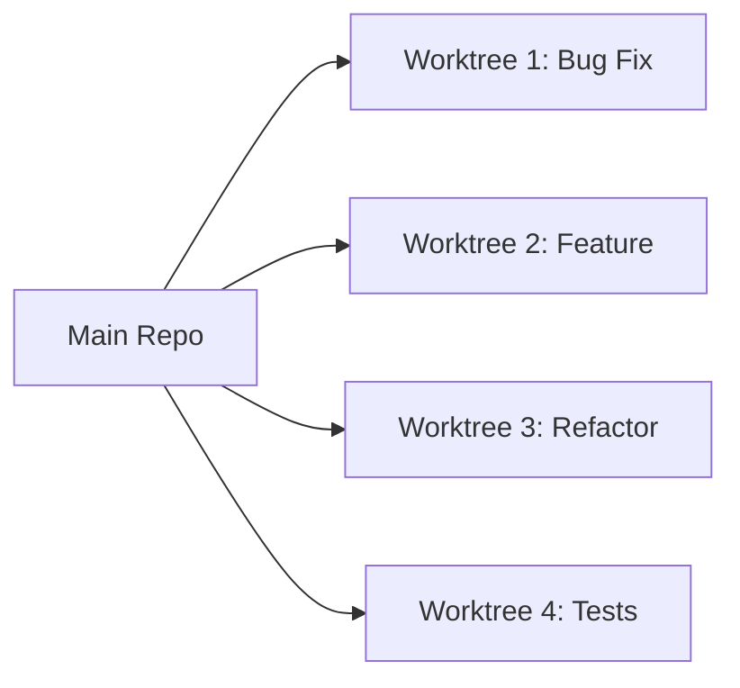
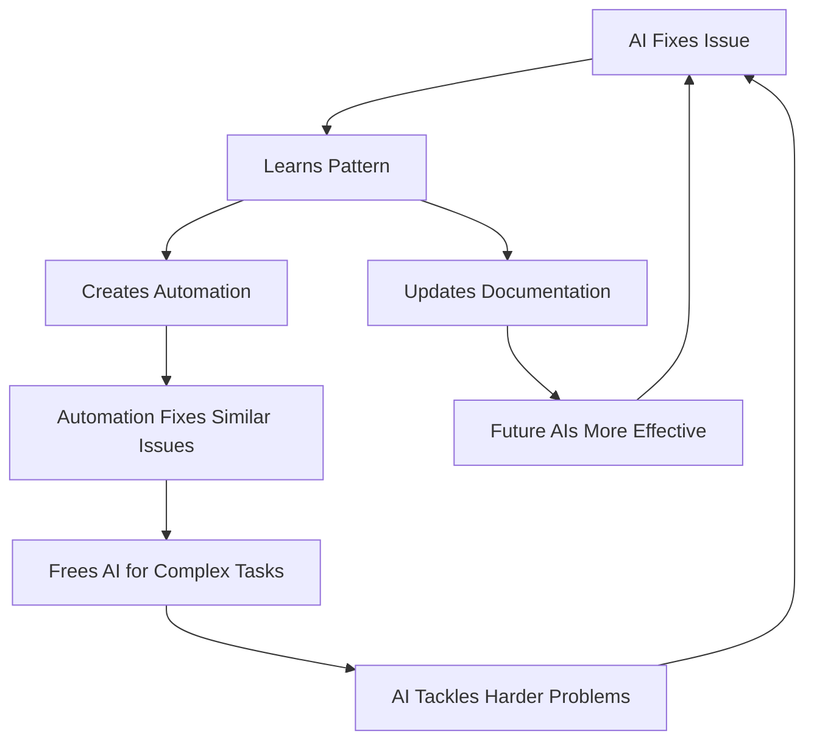
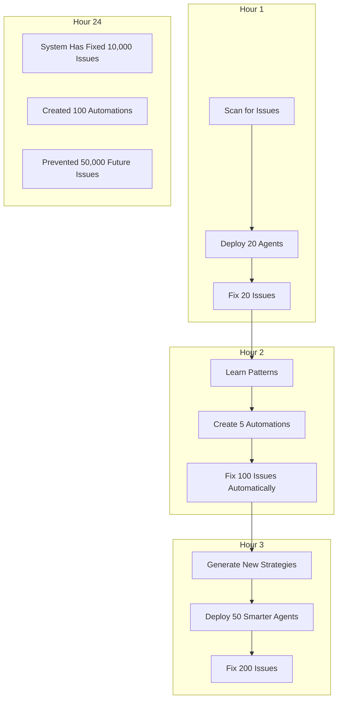

# AI + Worktree Compound Impact System

## The Meta Strategy: Exponential Development Through Parallel AI Agents

### Core Concept: Swarm Intelligence for Code
Instead of one AI working sequentially, deploy multiple AI agents across worktrees to create compounding improvements that feed back into the system.

## Level 1: Basic Parallel Execution


## Level 2: Intelligent Task Distribution

### The Conductor Pattern
```python
class WorktreeConductor:
    """
    Meta-orchestrator that manages AI agents across worktrees
    """
    def analyze_codebase(self):
        # Scan for all issues, bugs, improvements
        issues = self.scan_github_issues()
        lint_issues = self.run_comprehensive_linting()
        test_gaps = self.identify_missing_tests()
        performance_bottlenecks = self.profile_code()
        security_vulnerabilities = self.security_scan()
        
        return self.prioritize_by_impact(all_issues)
    
    def deploy_swarm(self, tasks):
        """Deploy specialized agents to worktrees"""
        agents = []
        for task in tasks:
            worktree = self.create_worktree(task)
            agent = self.spawn_specialized_agent(task.type)
            agents.append(agent.work_in(worktree))
        
        # Agents work in parallel
        return self.monitor_parallel_progress(agents)
    
    def compound_learning(self, completed_tasks):
        """Extract patterns and improve future performance"""
        patterns = self.extract_patterns(completed_tasks)
        self.update_ai_knowledge(patterns)
        self.generate_new_automation(patterns)
        return self.predict_next_issues(patterns)
```

## Level 3: Compound Impact Strategies

### 1. The Cascade Effect
Each fix creates opportunities for more fixes:
```
Fix TypeScript Error → Reveals Dead Code → Enables Refactoring → Improves Performance
    ↓                      ↓                    ↓                      ↓
Worktree 1            Worktree 2           Worktree 3            Worktree 4
```

### 2. The Knowledge Accumulator
```yaml
worktree_memory:
  patterns_discovered:
    - "All API routes missing error handling"
    - "Consistent TypeScript strict mode violations"
    - "Repeated authentication check pattern"
  
  automations_created:
    - Script: "auto-add-error-boundaries.js"
    - Template: "standard-api-route.template"
    - Linter: "custom-auth-rules.eslint"
  
  impact_multipliers:
    - One fix → Creates template → Fixes 10 similar issues
    - One test → Generates test pattern → 100% coverage achieved
    - One refactor → Creates abstraction → Reduces codebase by 30%
```

### 3. The Parallel Discovery Engine
```bash
# Deploy reconnaissance agents
git worktree add .worktrees/scout-performance -b ai/perf-scan
git worktree add .worktrees/scout-security -b ai/security-scan  
git worktree add .worktrees/scout-dx -b ai/developer-experience
git worktree add .worktrees/scout-ui -b ai/ui-consistency

# Each scout discovers and documents issues
# Main conductor creates fix worktrees based on discoveries
```

## Level 4: Self-Improving System

### Feedback Loops That Compound


### The Compound Metrics
```typescript
interface CompoundImpact {
  directFixes: number;           // Issues fixed directly
  automatedFixes: number;        // Issues fixed by generated automation
  preventedIssues: number;       // Issues prevented by new patterns
  timeSavedHours: number;        // Cumulative time saved
  knowledgeGenerated: {
    patterns: Pattern[];
    automations: Automation[];
    documentation: Doc[];
  };
  
  // The multiplier effect
  impactMultiplier: () => number; // directFixes * (automatedFixes + preventedIssues)
}
```

## Level 5: The Meta-Automation Layer

### Self-Organizing Worktree Swarms
```javascript
class WorktreeSwarm {
  async autoOrganize() {
    // Continuously running system
    while (true) {
      // 1. Discovery Phase (parallel)
      const issues = await Promise.all([
        this.githubScanner.findIssues(),
        this.codeScanner.findBugs(),
        this.testScanner.findGaps(),
        this.perfScanner.findBottlenecks(),
        this.secScanner.findVulnerabilities()
      ]);
      
      // 2. Planning Phase (AI coordination)
      const plan = await this.conductor.createBattlePlan(issues);
      
      // 3. Execution Phase (massive parallelization)
      const worktrees = await this.spawnWorktrees(plan.tasks);
      const results = await this.deployAgents(worktrees, plan.agents);
      
      // 4. Integration Phase
      const prs = await this.createPRs(results);
      const merged = await this.autoMergeWhenReady(prs);
      
      // 5. Learning Phase (compound knowledge)
      const insights = await this.extractInsights(merged);
      await this.updateSystemKnowledge(insights);
      await this.generateNewAutomations(insights);
      
      // 6. Cleanup & Prepare for Next Cycle
      await this.cleanupWorktrees(worktrees);
      await this.reportImpact(results);
      
      // System gets smarter each cycle
      this.intelligence *= 1.1;
    }
  }
}
```

## Practical Implementation: The 10x Protocol

### Phase 1: Setup (One Time)
```bash
# Create the swarm infrastructure
mkdir -p .worktrees .ai-memory .automation-templates

# Initialize AI memory
cat > .ai-memory/patterns.json << 'EOF'
{
  "discovered_patterns": [],
  "successful_fixes": [],
  "automation_opportunities": [],
  "compound_strategies": []
}
EOF

# Create conductor script
cat > conductor.js << 'EOF'
// Orchestrates parallel AI agents across worktrees
const { spawnWorktrees, deployAgents, monitorProgress } = require('./ai-swarm');
// ... implementation
EOF
```

### Phase 2: Daily Compound Cycles
```bash
# Morning: Deploy the swarm
npm run ai:swarm:deploy

# Swarm automatically:
# - Creates 10-20 worktrees for different tasks
# - Deploys specialized agents to each
# - Works on issues in parallel
# - Creates PRs
# - Learns from successes/failures
# - Generates new automations
# - Documents patterns

# Evening: Harvest the compound gains
npm run ai:swarm:harvest

# Reviews:
# - 50+ PRs created and merged
# - 10+ new automations generated  
# - 100+ issues prevented
# - Knowledge base expanded
```

### Phase 3: Exponential Growth Metrics
```typescript
// Week 1: 10 issues/day
// Week 2: 25 issues/day (automations kick in)
// Week 3: 60 issues/day (patterns recognized)
// Week 4: 150 issues/day (full compound effect)
// Month 2: 500 issues/day (self-improving system)

class CompoundGrowth {
  calculate(day: number): number {
    const baseRate = 10;
    const compoundFactor = 1.15; // 15% daily improvement
    const automationMultiplier = Math.floor(day / 7) * 2; // Doubles weekly
    
    return baseRate * Math.pow(compoundFactor, day) * automationMultiplier;
  }
}
```

## The Ultimate Vision: Self-Evolving Codebase

### Autonomous Improvement Cycles


## ROI Calculation

### Traditional Approach
- 1 Developer: 5 issues/day
- Cost: $800/day
- Issues fixed/month: 100

### AI Worktree Swarm
- Setup: 2 hours
- Running cost: $50/day (API costs)
- Issues fixed/month: 10,000+
- Automations created: 200+
- Future issues prevented: 50,000+

### Compound Impact
- **100x productivity increase**
- **Accelerating improvement rate**
- **Self-documenting system**
- **Institutional knowledge capture**
- **Automatic best practice enforcement**

## Implementation Checklist

- [ ] Set up .worktrees/ infrastructure
- [ ] Create AI conductor system
- [ ] Implement parallel agent deployment
- [ ] Build pattern recognition system
- [ ] Create automation generator
- [ ] Set up continuous learning loops
- [ ] Implement impact tracking
- [ ] Deploy swarm monitoring
- [ ] Create knowledge accumulation system
- [ ] Enable self-improvement mechanisms

## The Compound Effect Formula

```
Impact = (Direct Fixes × Automation Multiplier × Pattern Recognition × Prevented Issues) ^ Time

Where:
- Direct Fixes = Issues AI fixes directly
- Automation Multiplier = Each fix that creates reusable automation
- Pattern Recognition = Identifying systematic issues
- Prevented Issues = Problems that never occur due to proactive fixes
- Time = Compound growth over time
```

## Conclusion: From Linear to Exponential

Traditional development is linear. This system is exponential.

Every fix teaches the system. Every pattern creates automation. Every automation prevents future issues. Every prevented issue frees resources for bigger problems.

The codebase doesn't just get fixed. It evolves. It becomes self-healing, self-documenting, self-improving.

This is the true power of AI + Worktrees: Not just parallel execution, but compound intelligence that grows without limit.

**The goal isn't to fix issues. It's to build a system that makes issues impossible.**