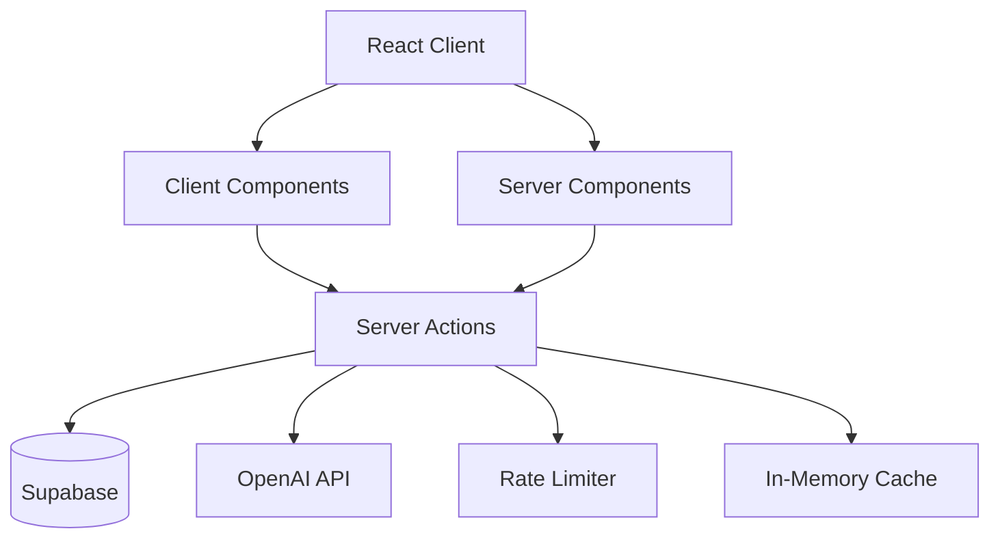

# CLAUDE.md - AI Assistant Context

This file provides comprehensive guidance to Claude Code and other AI assistants for optimal code generation and understanding.

## Quick Reference
- **Main entry**: app/layout.tsx
- **Server Actions**: server/actions/*.ts (always use `"use server"`)
- **Database types**: types/supabase.ts (auto-generated, never edit)
- **API pattern**: Server Actions only, no REST endpoints
- **Testing**: Co-located *.test.ts, E2E in tests/*.spec.ts
- **Documentation**: docs/ folder (organized by category)

## Documentation & Scripts Location

### Documentation (`docs/`)
All project documentation is organized in the `docs/` folder:
- `docs/setup/` - Environment setup guides (local, OAuth, Playwright)
- `docs/deployment/` - Deployment guides and configuration
- `docs/development/` - Development patterns, AI systems, testing
- `docs/analysis/` - UX analysis, audits, and improvements
- `docs/refactoring/` - Refactoring guides and migration steps
- `docs/README.md` - Documentation index with quick links

### Scripts (`scripts/`)
All automation and utility scripts are organized in the `scripts/` folder:
- `scripts/automation/` - AI-powered automation and workflow scripts
- `scripts/deployment/` - Deployment and infrastructure scripts
- `scripts/development/` - Development environment scripts
- `scripts/setup/` - Initial setup and configuration scripts
- `scripts/testing/` - Testing utilities and helpers
- `scripts/README.md` - Scripts documentation and usage

## Git Worktree Management

### IMPORTANT: Working with Worktrees
This repository uses git worktrees extensively. The main directory (`/Users/oliver/gh/neuros`) is typically on a feature branch, NOT main.

**Current Setup:**
- Main directory: Usually on `test-turbopack` or other feature branch
- Main branch worktree: `/Users/oliver/gh/neuros/.worktrees/issue-16`

### Worktree Commands for Claude Code
```bash
# Check current branch and worktree status
git worktree list
git branch --show-current

# When pushing to main (DO NOT checkout main in main directory):
git push origin HEAD:main  # Push current branch to main
# OR
git push origin test-turbopack:main  # Explicitly push test-turbopack to main

# To work on main branch directly:
cd /Users/oliver/gh/neuros/.worktrees/issue-16  # This is the main branch worktree

# Create a new worktree for a feature:
git worktree add .worktrees/new-feature -b feature/new-feature

# Remove a worktree:
git worktree remove .worktrees/feature-name
```

### Best Practices for Claude Code:
1. **NEVER** try to `git checkout main` in `/Users/oliver/gh/neuros`
2. **ALWAYS** check current branch with `git branch --show-current` first
3. **USE** `git push origin HEAD:main` to push current work to main
4. **CHECK** `git worktree list` to understand the repository structure
5. **WORK** on `test-turbopack` branch by default in main directory

## Development Commands

### Core Development
```bash
npm run dev              # Start development server (port 3000)
npm run dev:log          # Start dev server with log capture for Claude Code
npm run build           # Production build
npm run start           # Start production server
npm run lint            # Run ESLint
npm run typecheck       # TypeScript type checking
```

### Log Management for Claude Code Integration
```bash
npm run logs             # Show latest logs (last 100 lines)
npm run logs:full        # Show full latest log file
npm run logs:live        # Follow logs in real-time

# Manual log capture for any command
./scripts/development/log-capture.sh 'your-command-here'

# Log files location: /Users/oliver/gh/neuros/logs/
# Latest log symlink: /Users/oliver/gh/neuros/logs/latest.log
```

### Testing Commands
```bash
npm run test            # Run Vitest unit tests
npm run test:ui         # Interactive Vitest UI
npm run test:coverage   # Generate coverage report
npm run test:e2e        # Run Playwright E2E tests (headless)
npm run test:e2e:ui     # Playwright test UI
npm run test:e2e:debug  # Debug Playwright tests (headed)

# Generate comprehensive test manifest
node scripts/generate-test-manifest.js
npm run test:report     # Generate and view test coverage report
```

### Browser Testing Commands
```bash
npm run browser:clean   # Fix browser lock issues (use before MCP Playwright)
npm run browser:setup   # Clean browser + ensure dev server running

# Quick browser fix workflow:
# 1. Run: npm run browser:clean
# 2. Use MCP Playwright tools normally
```

### Database Management
```bash
npm run db:start        # Start local Supabase
npm run db:stop         # Stop local Supabase  
npm run db:reset        # Reset database and apply migrations
npm run db:types        # Generate TypeScript types from schema
npm run db:push         # Deploy migrations to production
```

### Analysis Tools
```bash
npm run analyze         # Bundle size analysis
npm run analyze:server  # Server bundle analysis
npm run analyze:browser # Browser bundle analysis
```

## Architecture Overview

### System Architecture Diagram


### Tech Stack
- **Framework**: Next.js 15.4 with App Router
- **Database**: Supabase (PostgreSQL + Auth + Realtime)
- **Language**: TypeScript/JavaScript with JSDoc support
- **Styling**: Tailwind CSS v4 (via PostCSS) + shadcn/ui components
- **AI Integration**: OpenAI GPT-4o for card generation
- **Testing**: Vitest (unit) + Playwright (E2E)

### Project Structure
```
app/
├── (auth)/           # Authentication pages (signin, signup, reset)
├── (dashboard)/      # Protected dashboard routes
├── (public)/         # Public marketing pages
├── api/              # API routes
└── auth/callback/    # Supabase auth callback

server/
├── actions/          # Server Actions (use server directive)
│   ├── ai.ts        # AI card generation with rate limiting
│   ├── auth.ts      # Authentication actions
│   ├── cards.ts     # Card CRUD operations
│   └── reviews.ts   # Spaced repetition logic
└── queries/          # Database query functions

components/
├── ui/              # Reusable shadcn/ui components
├── features/        # Feature-specific components
├── learning/        # Learning system components
├── landing/         # Landing page components
└── icons/           # Custom SVG icons (line-icons.tsx)

supabase/
└── migrations/      # SQL migrations (source of truth)
```

### Key Architectural Patterns

#### Feature Map
| Feature | Location | Server Action | Database Tables | Rate Limit |
|---------|----------|---------------|-----------------|------------|
| Auth | app/(auth) | server/actions/auth.ts | profiles | None |
| Cards | components/learning | server/actions/cards.ts | cards, card_images | CARD_GENERATION |
| Reviews | components/learning | server/actions/reviews.ts | reviews | None |
| AI Generation | server/actions | server/actions/ai.ts | cards | GLOBAL_AI |

#### Server Components by Default
- All components are Server Components unless marked with `'use client'`
- Use Server Actions for mutations (marked with `'use server'`)
- Client components only when needed for interactivity

#### Database-First Development
- **CRITICAL**: All schema changes must go through migrations
- Never modify database directly - use migrations in `supabase/migrations/`
- After adding migrations: `npm run db:reset` then `npm run db:types`
- Types are auto-generated in `types/supabase.ts`

#### Rate Limiting System
- Implemented in `lib/rate-limit-server.ts` for server-side
- Multiple tiers: CARD_GENERATION, GLOBAL_AI, IMAGE_GENERATION
- Uses sliding window algorithm with Redis-like in-memory store
- Throws `RateLimitExceededError` with retry information

#### Authentication Flow
- Supabase Auth with email/password
- Protected routes use middleware in `middleware.ts`
- Auth callback at `/auth/callback` handles OAuth returns
- Server Actions check authentication via `supabase.auth.getUser()`

#### AI Integration Pattern
```typescript
// Standard Server Action Template
"use server"

import { z } from 'zod'
import { createClient } from '@/lib/supabase/server'
import { checkRateLimit } from '@/lib/rate-limit-server'

// 1. Define Zod schema for input validation
const InputSchema = z.object({
  prompt: z.string().min(1).max(1000),
  options: z.object({ temperature: z.number().optional() })
})

type ActionInput = z.infer<typeof InputSchema>
type ActionResult<T> = { data: T } | { error: string }

export async function generateContent(input: ActionInput): Promise<ActionResult<GeneratedContent>> {
  // 2. Authenticate user
  const supabase = await createClient()
  const { data: { user } } = await supabase.auth.getUser()
  if (!user) return { error: 'Unauthorized' }
  
  // 3. Validate input
  const validated = InputSchema.parse(input)
  
  // 4. Check rate limits
  try {
    await checkRateLimit(user.id, 'CARD_GENERATION')
  } catch (error) {
    if (error instanceof RateLimitExceededError) {
      return { error: `Rate limit exceeded. Retry after ${error.retryAfter}s` }
    }
    throw error
  }
  
  // 5. Execute business logic
  try {
    const result = await openai.chat.completions.create({
      model: 'gpt-4o',
      messages: [{ role: 'user', content: validated.prompt }],
      temperature: validated.options.temperature
    })
    
    // 6. Store in database
    const { data, error } = await supabase
      .from('generated_content')
      .insert({ user_id: user.id, content: result.choices[0].message.content })
      .select()
      .single()
    
    if (error) throw error
    
    // 7. Return typed result
    return { data }
  } catch (error) {
    console.error('Generation failed:', error)
    return { error: 'Generation failed. Please try again.' }
  }
}
```

## Critical Development Rules

### Database Operations
1. **ALWAYS** use migrations for schema changes
2. Run `npm run db:types` after any migration
3. Use transactions for multi-table operations
4. Check user authentication before database writes

### Error Handling
- Guard window access: `if (typeof window === 'undefined')`
- Wrap async operations in try-catch blocks
- Use `RateLimitExceededError` for rate limit violations
- Return meaningful error messages from Server Actions

### Testing Requirements
- Test with `npm run build` before committing
- Run `npm run test:e2e` for critical user flows
- Use `generate-test-manifest.js` to identify untested areas
- Priority test areas: auth flows, dashboard, API routes

### UI/UX Conventions
- Custom line-art SVG icons only (no emoji icons)
- Editorial design aesthetic with clean typography
- Use shadcn/ui components from `components/ui/`
- Responsive design with mobile-first approach
- **CRITICAL**: NO GRADIENT BACKGROUNDS - User hates gradients, use solid colors only

## Environment Variables

Required in `.env.local`:
```env
# Supabase
NEXT_PUBLIC_SUPABASE_URL=
NEXT_PUBLIC_SUPABASE_ANON_KEY=
SUPABASE_SERVICE_ROLE_KEY=

# OpenAI
OPENAI_API_KEY=
```

## Pre-commit Hooks

Husky runs on commit (currently with some checks disabled for rapid deployment):
- Linting (active)
- Type checking (temporarily disabled)
- Tests (temporarily disabled)

Re-enable in `.husky/pre-commit` when stabilized.

## Browser Testing Best Practices

### MCP Playwright Workflow
1. **Always run first**: `npm run browser:clean` (fixes 90% of browser issues)
2. Use MCP Playwright tools normally
3. If you get browser lock errors, repeat step 1

### Parallel Testing Options
- **MCP Playwright**: Single browser session with tabs (sequential)
- **E2E Tests**: `npm run test:e2e` (true parallel with multiple workers)
- **Manual Testing**: Use `npm run browser:setup` for consistent dev environment

### Common Browser Issues & Fixes
- **"Browser is already in use"**: Run `npm run browser:clean`
- **Dev server not running**: Run `npm run browser:setup`
- **Stuck browser processes**: Browser helper automatically kills them

## Testing Patterns

### Test Structure (BDD Style)
```typescript
// features/cards/cards.test.ts
describe('Card Management', () => {
  describe('Given a user with a deck', () => {
    describe('When creating a new card', () => {
      it('Then should add card to deck', async () => {
        // Arrange: Set up test data
        const user = await createTestUser()
        const deck = await createTestDeck(user.id)
        
        // Act: Execute the action
        const result = await createCard({
          deck_id: deck.id,
          front: 'Test Question',
          back: 'Test Answer'
        })
        
        // Assert: Verify outcome
        expect(result.data).toBeDefined()
        expect(result.error).toBeUndefined()
        expect(result.data?.front).toBe('Test Question')
      })
    })
  })
})
```

### Test Factories
```typescript
// lib/test/factories.ts
export const makeCard = (overrides?: Partial<Card>): Card => ({
  id: crypto.randomUUID(),
  front: 'Default front',
  back: 'Default back',
  deck_id: crypto.randomUUID(),
  created_at: new Date().toISOString(),
  ...overrides
})

export const makeUser = (overrides?: Partial<User>): User => ({
  id: crypto.randomUUID(),
  email: `test-${Date.now()}@example.com`,
  created_at: new Date().toISOString(),
  ...overrides
})
```

## Common Development Tasks

### Adding a New Feature
1. Create migrations if database changes needed
2. Generate types: `npm run db:types`
3. Implement Server Actions in `server/actions/`
4. Create UI components (Server Components by default)
5. Add client interactivity only where needed
6. Test with `npm run build` and `npm run test:e2e`

### Debugging Issues
- **Browser testing**: Run `npm run browser:clean` first
- Check browser console for client-side errors
- Check terminal for Server Component errors
- Use `npm run dev:debug` for Node.js debugging
- Review rate limit logs in server console
- Check Supabase logs: `supabase status`

### Performance Optimization
- Use `npm run analyze` to check bundle sizes
- Implement dynamic imports for heavy components
- Use Server Components to reduce client bundle
- Enable `optimizePackageImports` in next.config.ts

## Code Generation Templates

### Creating a New Feature Module
```bash
# Example: Creating a 'decks' feature
mkdir -p features/decks/{components,actions,hooks,types,tests}
touch features/decks/index.ts
touch features/decks/actions/decks.actions.ts
touch features/decks/components/DeckList.tsx
touch features/decks/hooks/useDecks.ts
touch features/decks/types/decks.types.ts
touch features/decks/tests/decks.test.ts
```

### Server Action Boilerplate
```typescript
// features/[feature]/actions/[feature].actions.ts
"use server"

import { z } from 'zod'
import { createClient } from '@/lib/supabase/server'
import type { ActionResult } from '@/types/api'

const Schema = z.object({
  // Define your schema here
})

export async function actionName(input: z.infer<typeof Schema>): Promise<ActionResult<OutputType>> {
  const supabase = await createClient()
  const { data: { user } } = await supabase.auth.getUser()
  if (!user) return { error: 'Unauthorized' }
  
  try {
    const validated = Schema.parse(input)
    // Implementation here
    return { data: result }
  } catch (error) {
    return { error: error.message }
  }
}
```

## JSDoc Conventions

### Function Documentation
```typescript
/**
 * Creates a new flashcard with AI-generated content
 * @param prompt - The prompt for content generation
 * @param options - Optional generation parameters
 * @returns Promise with generated card or error
 * @throws {RateLimitExceededError} When rate limit is exceeded
 * @example
 * const result = await generateCard(
 *   "Create a flashcard about photosynthesis",
 *   { temperature: 0.7 }
 * )
 */
export async function generateCard(
  prompt: string,
  options?: GenerationOptions
): Promise<ActionResult<Card>> {
  // Implementation
}
```

### Type Documentation
```typescript
/**
 * Represents a flashcard in the learning system
 * @property {string} id - Unique identifier
 * @property {string} front - Question or prompt side
 * @property {string} back - Answer or response side
 * @property {number} ease_factor - Spaced repetition difficulty (2.5 default)
 */
export interface Card {
  id: string
  front: string
  back: string
  ease_factor: number
  created_at: string
  updated_at: string
}
```