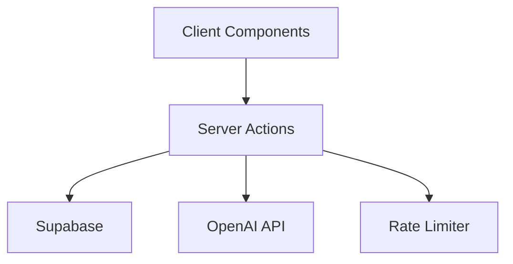

# Neuros Codebase Refactoring Guide for 2025 AI-Assisted Development

## Executive Summary

This guide outlines specific refactoring strategies to optimize the Neuros codebase for efficient collaboration with AI coding assistants (Claude Code, Cursor, GitHub Copilot) based on 2025 best practices.

## Current State Analysis

### Strengths
- Clear separation of server/client code with Next.js App Router
- TypeScript throughout with good type coverage
- Established testing infrastructure (Vitest + Playwright)
- Well-structured Supabase migrations
- Comprehensive CLAUDE.md documentation

### Improvement Opportunities
- Components scattered across multiple directories without clear feature boundaries
- Mixed organizational patterns (feature-based vs technical-based)
- Inconsistent testing patterns and locations
- Limited JSDoc documentation for AI context
- Rate limiting could be more modular
- Server Actions could benefit from better error patterns

## Refactoring Plan

### 1. Feature-Based Modular Architecture

Transform the current mixed structure into clear feature modules:

```
features/
├── auth/
│   ├── components/
│   │   ├── SignInForm.tsx
│   │   ├── SignUpForm.tsx
│   │   └── PasswordReset.tsx
│   ├── actions/
│   │   └── auth.actions.ts
│   ├── hooks/
│   │   └── useAuth.ts
│   ├── types/
│   │   └── auth.types.ts
│   ├── tests/
│   │   ├── auth.test.ts
│   │   └── auth.e2e.spec.ts
│   └── index.ts
├── cards/
│   ├── components/
│   │   ├── CardList.tsx
│   │   ├── CardDetail.tsx
│   │   └── CreateCardDialog.tsx
│   ├── actions/
│   │   ├── cards.actions.ts
│   │   └── ai-generation.actions.ts
│   ├── hooks/
│   │   ├── useCards.ts
│   │   └── useRealtimeCards.ts
│   ├── types/
│   │   └── cards.types.ts
│   ├── tests/
│   │   └── cards.test.ts
│   └── index.ts
├── dashboard/
│   ├── components/
│   │   ├── DashboardLayout.tsx
│   │   ├── DashboardStats.tsx
│   │   └── LearningProgress.tsx
│   ├── actions/
│   │   └── dashboard.actions.ts
│   ├── hooks/
│   │   └── useDashboard.ts
│   ├── types/
│   │   └── dashboard.types.ts
│   └── index.ts
└── shared/
    ├── ui/           # Keep shadcn/ui components here
    ├── utils/
    └── constants/
```

### 2. Enhanced Documentation Structure

#### Update CLAUDE.md with AI-Optimized Sections

```markdown
# CLAUDE.md - AI Assistant Context

## Quick Reference
- Main entry: app/layout.tsx
- Server Actions: features/*/actions/*.actions.ts
- Database schema: types/supabase.ts (auto-generated)
- API conventions: Always use Server Actions, no REST endpoints

## Architecture Overview


## Feature Map
| Feature | Location | Server Action | Database Tables |
|---------|----------|---------------|-----------------|
| Auth | features/auth | auth.actions.ts | profiles |
| Cards | features/cards | cards.actions.ts | cards, card_images |
| Reviews | features/reviews | reviews.actions.ts | reviews |

## Common Patterns

### Server Action Template
```typescript
"use server"
export async function actionName(input: Input): Promise<Result<Output>> {
  // 1. Authenticate
  const { user } = await supabase.auth.getUser()
  if (!user) return { error: 'Unauthorized' }
  
  // 2. Validate with Zod
  const validated = schema.parse(input)
  
  // 3. Check rate limits
  await checkRateLimit(user.id, 'ACTION_TYPE')
  
  // 4. Execute business logic
  try {
    const result = await businessLogic(validated)
    return { data: result }
  } catch (error) {
    return { error: error.message }
  }
}
```

## Testing Conventions
- Unit tests: *.test.ts co-located with source
- E2E tests: *.e2e.spec.ts in feature/tests/
- Test data factories: features/*/tests/factories.ts
```

### 3. Standardized Testing Patterns

#### Create Test Factories

```typescript
// features/cards/tests/factories.ts
export const makeCard = (overrides?: Partial<Card>): Card => ({
  id: crypto.randomUUID(),
  front: "Default front",
  back: "Default back",
  deck_id: crypto.randomUUID(),
  created_at: new Date().toISOString(),
  ...overrides
})

export const makeReview = (overrides?: Partial<Review>): Review => ({
  id: crypto.randomUUID(),
  card_id: crypto.randomUUID(),
  quality: 3,
  reviewed_at: new Date().toISOString(),
  ...overrides
})
```

#### BDD Test Structure

```typescript
// features/cards/tests/cards.test.ts
describe('Card Management', () => {
  describe('Given a user with existing cards', () => {
    describe('When creating a new card', () => {
      it('Then should add card to the deck', async () => {
        // Arrange
        const user = makeUser()
        const deck = makeDeck({ user_id: user.id })
        
        // Act
        const result = await createCard({
          deck_id: deck.id,
          front: 'Test front',
          back: 'Test back'
        })
        
        // Assert
        expect(result.data).toBeDefined()
        expect(result.data.front).toBe('Test front')
      })
    })
  })
})
```

### 4. Server Components & Actions Optimization

#### Typed Server Actions with Zod

```typescript
// features/cards/actions/cards.actions.ts
import { z } from 'zod'

const CreateCardSchema = z.object({
  deck_id: z.string().uuid(),
  front: z.string().min(1).max(1000),
  back: z.string().min(1).max(1000),
  tags: z.array(z.string()).optional()
})

type CreateCardInput = z.infer<typeof CreateCardSchema>

export async function createCard(input: CreateCardInput) {
  "use server"
  
  // Validation happens first
  const validated = CreateCardSchema.parse(input)
  
  // Rest of implementation...
}
```

#### Co-located Data Fetching

```typescript
// app/(dashboard)/dashboard/page.tsx
export default async function DashboardPage() {
  // Data fetching in the component
  const supabase = await createClient()
  const { data: { user } } = await supabase.auth.getUser()
  
  if (!user) redirect('/signin')
  
  const stats = await getDashboardStats(user.id)
  
  return <DashboardClient initialStats={stats} />
}
```

### 5. Rate Limiting Factory Pattern

```typescript
// lib/rate-limit/factory.ts
export function createRateLimiter(config: RateLimiterConfig) {
  return new RateLimiter({
    windowMs: config.windowMs,
    maxRequests: config.maxRequests,
    keyGenerator: config.keyGenerator
  })
}

// lib/rate-limit/presets.ts
export const rateLimiters = {
  aiGeneration: createRateLimiter({
    windowMs: 60000,
    maxRequests: 10,
    keyGenerator: (userId) => `ai_gen:${userId}`
  }),
  
  imageGeneration: createRateLimiter({
    windowMs: 300000,
    maxRequests: 5,
    keyGenerator: (userId) => `img_gen:${userId}`
  })
}

// Usage in Server Actions
import { rateLimiters } from '@/lib/rate-limit/presets'

export async function generateCard(prompt: string) {
  "use server"
  
  await rateLimiters.aiGeneration.check(userId)
  // Continue with generation...
}
```

### 6. Error Handling Patterns

```typescript
// lib/errors/app-errors.ts
export class AppError extends Error {
  constructor(
    message: string,
    public code: string,
    public statusCode: number = 500
  ) {
    super(message)
    this.name = 'AppError'
  }
}

export class ValidationError extends AppError {
  constructor(message: string) {
    super(message, 'VALIDATION_ERROR', 400)
  }
}

export class RateLimitError extends AppError {
  constructor(public retryAfter: number) {
    super('Rate limit exceeded', 'RATE_LIMIT_ERROR', 429)
  }
}

// lib/errors/handler.ts
export function handleActionError(error: unknown) {
  if (error instanceof AppError) {
    return { 
      error: error.message, 
      code: error.code,
      ...(error instanceof RateLimitError && { retryAfter: error.retryAfter })
    }
  }
  
  console.error('Unexpected error:', error)
  return { error: 'An unexpected error occurred', code: 'INTERNAL_ERROR' }
}
```

### 7. Performance Optimizations

#### Dynamic Imports

```typescript
// features/dashboard/components/DashboardClient.tsx
import dynamic from 'next/dynamic'

const KnowledgeGraph = dynamic(
  () => import('@/components/visualizations/knowledge-graph'),
  { 
    ssr: false,
    loading: () => <Skeleton className="h-96" />
  }
)

const DashboardStats = dynamic(
  () => import('./DashboardStats'),
  { loading: () => <StatsSkeletion /> }
)
```

#### Bundle Optimization

```typescript
// next.config.ts
export default {
  optimizePackageImports: [
    'lucide-react',
    '@tabler/icons-react',
    'd3',
    'framer-motion'
  ],
  
  experimental: {
    optimizeCss: true,
    turbo: {
      rules: {
        '*.svg': ['@svgr/webpack']
      }
    }
  }
}
```

### 8. Type Safety Enhancements

```typescript
// types/api.ts
export type Result<T> = 
  | { data: T; error?: never }
  | { data?: never; error: string }

export type AsyncResult<T> = Promise<Result<T>>

// Usage
export async function getCards(): AsyncResult<Card[]> {
  try {
    const cards = await fetchCards()
    return { data: cards }
  } catch (error) {
    return { error: error.message }
  }
}
```

## Implementation Roadmap

### Phase 1: Documentation & Standards (Week 1)
- [ ] Update CLAUDE.md with comprehensive patterns
- [ ] Create JSDoc templates for all public functions
- [ ] Document Server Action conventions
- [ ] Add architecture diagrams

### Phase 2: Feature Modularization (Week 2-3)
- [ ] Refactor auth features into module
- [ ] Refactor cards features into module
- [ ] Refactor dashboard features into module
- [ ] Update import paths

### Phase 3: Testing Infrastructure (Week 3-4)
- [ ] Create test factories
- [ ] Implement BDD test structure
- [ ] Add test metadata annotations
- [ ] Generate comprehensive test coverage

### Phase 4: Performance & Optimization (Week 4-5)
- [ ] Implement dynamic imports
- [ ] Add bundle optimization
- [ ] Configure edge runtime where appropriate
- [ ] Add observability annotations

### Phase 5: AI Integration Enhancement (Week 5-6)
- [ ] Add comprehensive JSDoc comments
- [ ] Create code generation templates
- [ ] Document common patterns
- [ ] Test with AI assistants

## Success Metrics

- **AI Suggestion Accuracy**: Target 25% improvement in relevant completions
- **Code Generation Speed**: 50% reduction in prompt iterations
- **Test Coverage**: Achieve 80% coverage with AI-generated tests
- **Bundle Size**: 20% reduction through code splitting
- **Developer Velocity**: 30% faster feature implementation

## Maintenance Guidelines

1. **Regular Updates**: Review and update CLAUDE.md weekly
2. **Pattern Library**: Maintain pattern examples in documentation
3. **Test Templates**: Keep test factories current with schema changes
4. **Performance Monitoring**: Track bundle sizes and Core Web Vitals
5. **AI Feedback Loop**: Document AI assistant failures and successes

## Tools & Scripts

### Refactoring Helper Scripts

```bash
# scripts/refactor-to-features.sh
#!/bin/bash
# Helps migrate components to feature modules

# scripts/generate-jscdoc.ts
# Adds JSDoc comments to exported functions

# scripts/test-factory-generator.ts
# Creates test factories from TypeScript types
```

## Conclusion

This refactoring plan aligns the Neuros codebase with 2025 best practices for AI-assisted development. The modular architecture, comprehensive documentation, and standardized patterns will significantly improve AI comprehension and suggestion quality, leading to faster development cycles and higher code quality.