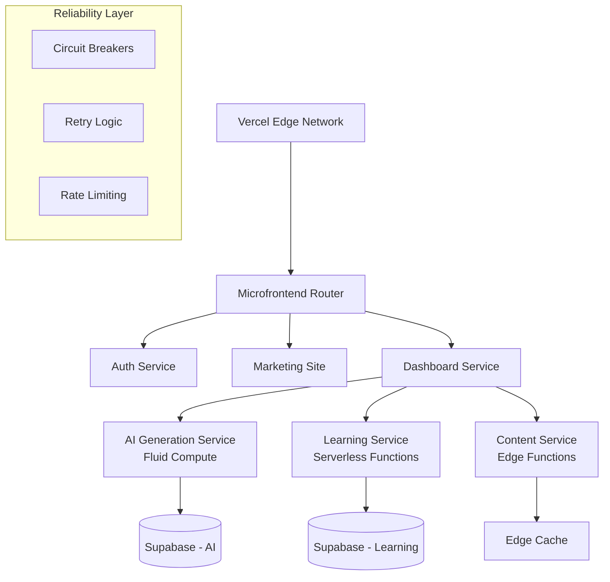

# Vercel-Native Microservices Architecture for Neuros

## Overview

This document outlines a comprehensive rearchitecture strategy to transform Neuros from a monolithic Next.js application into a reliable, scalable microservices architecture using Vercel's native platform capabilities. The strategy leverages Vercel's Microfrontends, Fluid Compute, Edge Functions, and reliability patterns to create a more maintainable and resilient system.

## Current Architecture Analysis

### Pain Points Identified
- **Single Point of Failure**: Monolithic deployment means any component failure affects entire system
- **Resource Contention**: AI generation workloads compete with lightweight operations
- **Scaling Limitations**: Cannot scale individual components based on demand
- **Development Bottlenecks**: Changes to any component require full redeployment
- **Rate Limiting Complexity**: Shared rate limits across all operations
- **Testing Challenges**: Difficult to isolate and test individual components

## 🏗️ Recommended Architecture: Vercel-Native Microservices

### Service Decomposition Strategy

**Decompose by Business Domain:**
```
├── 🎯 Core Services (High Priority)
│   ├── auth-service/          # Authentication & user management
│   ├── ai-generation-service/ # OpenAI card generation & tuning
│   ├── learning-service/      # Spaced repetition & reviews  
│   └── content-service/       # Card storage & retrieval
│
├── 🔧 Support Services (Medium Priority) 
│   ├── insights-service/      # Analytics & progress tracking
│   ├── search-service/        # Smart search & discovery
│   └── image-service/         # Image generation & optimization
│
└── 🌐 Experience Services (Lower Priority)
    ├── marketing-site/        # Landing pages & public content
    ├── dashboard-service/     # User dashboard aggregation
    └── api-gateway/          # Request routing & composition
```

### Vercel Platform Strategy

**Leverage Vercel's Native Microservices Support:**

- **Vercel Microfrontends**: Native edge routing between independent deployments
- **Fluid Compute**: Hybrid serverless for AI workloads with background processing
- **Edge Functions**: Global content delivery and lightweight compute
- **Serverless Functions**: Heavy processing with configurable resources

### Implementation Architecture



## Detailed Service Architecture

### 🔐 Auth Service (Edge Functions)

**Purpose**: Lightweight, global authentication and authorization
**Runtime**: Edge Functions for minimal latency
**Regions**: Global distribution with failover

```typescript
// auth-service/middleware.ts
export const runtime = 'edge'
export const preferredRegion = ['iad1', 'hnd1', 'fra1']

// Fast token validation at the edge
export async function middleware(request: Request) {
  const token = getTokenFromHeader(request)
  
  try {
    if (!await validateToken(token)) {
      return new Response('Unauthorized', { status: 401 })
    }
    return next()
  } catch (error) {
    // Graceful degradation - allow request through with warning
    console.warn('Auth service degraded:', error)
    return next({
      headers: { 'X-Auth-Status': 'degraded' }
    })
  }
}

// auth-service/api/validate.ts
export async function POST(request: Request) {
  const { token } = await request.json()
  
  return withCircuitBreaker('auth-validation', async () => {
    const user = await validateUserToken(token)
    return Response.json({ user, valid: true })
  })
}
```

### 🤖 AI Generation Service (Fluid Compute)

**Purpose**: Heavy AI workloads with background processing
**Runtime**: Fluid Compute with optimized concurrency
**Features**: Rate limiting, background tasks, error recovery

```typescript
// ai-service/api/generate-card.ts
export const runtime = 'nodejs'
export const memory = 1024
export const maxDuration = 30

export async function POST(request: Request) {
  const { prompt, userId } = await request.json()
  
  // Rate limiting per user
  const { rateLimited } = await checkRateLimit('AI_GENERATION', userId)
  if (rateLimited) {
    return Response.json(
      { error: 'Rate limit exceeded' }, 
      { status: 429 }
    )
  }
  
  try {
    // Generate card with OpenAI
    const card = await withRetry(() => 
      generateCardWithOpenAI(prompt), 
      { retries: 3, backoff: 'exponential' }
    )
    
    // Background processing with waitUntil
    waitUntil(async () => {
      try {
        await analyzeCardQuality(card)
        await updateUserInsights(userId, card)
        await logGenerationMetrics(userId, prompt, card)
      } catch (error) {
        console.error('Background processing failed:', error)
        // Don't fail the main request for background tasks
      }
    })
    
    return Response.json({ card })
  } catch (error) {
    console.error('AI Generation failed:', error)
    return Response.json(
      { error: 'Generation failed', retry: true }, 
      { status: 500 }
    )
  }
}
```

### 📚 Learning Service (Serverless Functions)

**Purpose**: Spaced repetition logic and review management
**Runtime**: Node.js serverless with database connection pooling
**Features**: Optimized database connections, transaction support

```typescript
// learning-service/api/review.ts
export const runtime = 'nodejs'
export const preferredRegion = ['iad1']

export async function POST(request: Request) {
  const { cardId, userId, response } = await request.json()
  
  const pool = createDatabasePool()
  attachDatabasePool(pool) // Keep connection alive across invocations
  
  return withRetry(async () => {
    return await withTransaction(async (tx) => {
      // Calculate next review time using spaced repetition
      const review = await calculateSpacedRepetition(cardId, response, tx)
      
      // Update user progress
      await updateUserProgress(userId, cardId, review, tx)
      
      // Get next cards for review
      const nextCards = await getNextReviewCards(userId, tx)
      
      return Response.json({ 
        review, 
        nextCards,
        progress: await getUserProgress(userId, tx)
      })
    })
  }, { 
    retries: 3, 
    backoff: 'exponential',
    retryIf: (error) => error.code === 'TRANSACTION_CONFLICT'
  })
}
```

### 🎯 Content Service (Edge Functions)

**Purpose**: Fast content retrieval with global caching
**Runtime**: Edge Functions for minimal latency
**Features**: Intelligent caching, content optimization

```typescript
// content-service/api/cards/[id].ts
export const runtime = 'edge'

export async function GET(request: Request, { params }: { params: { id: string } }) {
  const cardId = params.id
  const cacheKey = `card:${cardId}`
  
  // Try edge cache first
  const cached = await cache.get(cacheKey)
  if (cached) {
    return new Response(cached, {
      headers: { 
        'Content-Type': 'application/json',
        'Cache-Control': 'public, max-age=300',
        'X-Cache': 'HIT'
      }
    })
  }
  
  try {
    const card = await fetchCardFromDatabase(cardId)
    
    // Cache at edge for fast future access
    await cache.set(cacheKey, JSON.stringify(card), { ttl: 300 })
    
    return Response.json(card, {
      headers: { 
        'Cache-Control': 'public, max-age=300',
        'X-Cache': 'MISS'
      }
    })
  } catch (error) {
    return withFallback(() => {
      // Serve stale content if available
      return getStaleCard(cardId)
    }, error)
  }
}
```

## Reliability & Fault Tolerance Patterns

### Circuit Breaker Implementation

```typescript
// lib/circuit-breaker.ts
class CircuitBreaker {
  private failureCount = 0
  private lastFailureTime = 0
  private state: 'CLOSED' | 'OPEN' | 'HALF_OPEN' = 'CLOSED'
  
  constructor(
    private threshold = 5,
    private timeout = 60000, // 1 minute
    private monitoringPeriod = 10000 // 10 seconds
  ) {}
  
  async execute<T>(fn: () => Promise<T>, fallback?: () => Promise<T>): Promise<T> {
    if (this.state === 'OPEN') {
      if (Date.now() - this.lastFailureTime > this.timeout) {
        this.state = 'HALF_OPEN'
      } else {
        if (fallback) return await fallback()
        throw new Error('Circuit breaker is OPEN')
      }
    }
    
    try {
      const result = await fn()
      this.reset()
      return result
    } catch (error) {
      this.recordFailure()
      if (fallback) return await fallback()
      throw error
    }
  }
  
  private recordFailure() {
    this.failureCount++
    this.lastFailureTime = Date.now()
    
    if (this.failureCount >= this.threshold) {
      this.state = 'OPEN'
      console.warn(`Circuit breaker opened after ${this.failureCount} failures`)
    }
  }
  
  private reset() {
    this.failureCount = 0
    this.state = 'CLOSED'
  }
}

// Usage
const openaiCircuitBreaker = new CircuitBreaker(3, 30000)

export async function withCircuitBreaker<T>(
  name: string,
  fn: () => Promise<T>,
  fallback?: () => Promise<T>
): Promise<T> {
  return circuitBreakers[name].execute(fn, fallback)
}
```

### Retry with Exponential Backoff

```typescript
// lib/retry.ts
export interface RetryOptions {
  retries: number
  backoff: 'linear' | 'exponential'
  retryIf?: (error: any) => boolean
  onRetry?: (error: any, attempt: number) => void
}

export async function withRetry<T>(
  fn: () => Promise<T>,
  options: RetryOptions = { retries: 3, backoff: 'exponential' }
): Promise<T> {
  let lastError: any
  
  for (let attempt = 0; attempt <= options.retries; attempt++) {
    try {
      return await fn()
    } catch (error) {
      lastError = error
      
      if (attempt === options.retries) break
      
      // Check if we should retry this error
      if (options.retryIf && !options.retryIf(error)) {
        throw error
      }
      
      // Call retry callback
      options.onRetry?.(error, attempt + 1)
      
      // Calculate delay
      const delay = options.backoff === 'exponential' 
        ? Math.min(1000 * Math.pow(2, attempt), 10000) // Cap at 10s
        : 1000 * (attempt + 1)
      
      // Add jitter to prevent thundering herd
      const jitter = Math.random() * 0.1 * delay
      
      await new Promise(resolve => setTimeout(resolve, delay + jitter))
    }
  }
  
  throw lastError
}
```

### Graceful Degradation

```typescript
// lib/fallback.ts
export async function withFallback<T>(
  primary: () => Promise<T>,
  error: any,
  fallback?: () => Promise<T>
): Promise<Response> {
  if (fallback) {
    try {
      const result = await fallback()
      return Response.json(result, {
        status: 200,
        headers: { 'X-Fallback': 'true' }
      })
    } catch (fallbackError) {
      console.error('Fallback also failed:', fallbackError)
    }
  }
  
  // Return graceful error response
  return Response.json(
    { 
      error: 'Service temporarily unavailable',
      message: 'Please try again in a few moments',
      retry: true
    },
    { 
      status: 503,
      headers: { 'Retry-After': '30' }
    }
  )
}
```

## Migration Strategy

### Phase 1: Extract High-Risk Services (2-3 weeks)

**Priority: Reduce System Risk**

1. **AI Generation Service** 
   - Extract to separate Vercel project with Fluid Compute
   - Implement independent rate limiting
   - Add circuit breakers for OpenAI API calls
   - Configure background processing with `waitUntil`

2. **Authentication Service**
   - Move to Edge Functions for global performance
   - Implement token validation at edge
   - Add graceful degradation for auth failures
   - Set up cross-region failover

3. **Content Service**
   - Implement edge caching for frequently accessed cards
   - Add content optimization and compression
   - Configure regional data replication

**Migration Steps:**
```bash
# 1. Create new Vercel projects
vercel init ai-generation-service
vercel init auth-service  
vercel init content-service

# 2. Configure microfrontends in main app
# Update vercel.json with microfrontend routing

# 3. Implement service interfaces
# Add TypeScript interfaces for service communication

# 4. Deploy and test each service independently
vercel deploy --prod

# 5. Update main app to call new services
# Implement service clients with retry logic
```

### Phase 2: Business Logic Services (3-4 weeks)

**Priority: Isolate Core Functionality**

1. **Learning Service**
   - Extract spaced repetition algorithms
   - Implement database connection pooling
   - Add transaction support for consistency
   - Configure regional optimization

2. **Search Service** 
   - Separate complex search logic
   - Implement search result caching
   - Add fuzzy matching and AI-powered suggestions
   - Configure independent scaling

3. **Analytics Service**
   - Move to background processing model
   - Implement event streaming
   - Add data aggregation pipelines
   - Configure non-critical path processing

### Phase 3: Experience Layer (2-3 weeks)

**Priority: Optimize User Experience**

1. **Marketing Site**
   - Static generation with global CDN
   - Implement A/B testing framework
   - Add performance monitoring
   - Configure SEO optimization

2. **Dashboard Service**
   - Aggregation layer for all services
   - Implement service composition
   - Add client-side caching
   - Configure progressive loading

3. **Mobile App**
   - Progressive Web App optimization
   - Implement offline capabilities
   - Add background sync
   - Configure app shell caching

## Vercel Configuration

### Microfrontends Setup

```json
// vercel.json
{
  "$schema": "https://openapi.vercel.sh/vercel.json",
  "version": 2,
  "microfrontends": {
    "auth": {
      "url": "https://auth-service.vercel.app"
    },
    "ai": {
      "url": "https://ai-generation-service.vercel.app"
    },
    "learning": {
      "url": "https://learning-service.vercel.app"
    },
    "content": {
      "url": "https://content-service.vercel.app"
    }
  },
  "routes": [
    {
      "src": "/api/auth/(.*)",
      "dest": "https://auth-service.vercel.app/api/$1"
    },
    {
      "src": "/api/ai/(.*)",
      "dest": "https://ai-generation-service.vercel.app/api/$1"
    },
    {
      "src": "/api/learning/(.*)",
      "dest": "https://learning-service.vercel.app/api/$1"
    },
    {
      "src": "/api/content/(.*)",
      "dest": "https://content-service.vercel.app/api/$1"
    }
  ]
}
```

### Function Configuration

```json
// Individual service vercel.json
{
  "functions": {
    "api/generate-card.js": {
      "runtime": "nodejs20.x",
      "memory": 1024,
      "maxDuration": 30
    },
    "api/auth/validate.js": {
      "runtime": "edge",
      "regions": ["iad1", "hnd1", "fra1"]
    }
  }
}
```

## Development Benefits

### Reliability Improvements
- ✅ **Fault Isolation**: Service failures don't cascade to entire system
- ✅ **Independent Scaling**: Scale AI service separately from content delivery
- ✅ **Regional Failover**: Automatic cross-region deployment and routing
- ✅ **Circuit Breakers**: Prevent overload of downstream services
- ✅ **Graceful Degradation**: Continue serving users even during partial failures

### Development Experience
- ✅ **Independent Teams**: Each service can be owned by different developers
- ✅ **Technology Diversity**: Use optimal runtime per service (Edge vs Node.js)
- ✅ **Faster Deployments**: Deploy only changed services, reducing deployment time
- ✅ **Easier Testing**: Isolated unit and integration testing per service
- ✅ **Parallel Development**: Multiple features can be developed simultaneously

### Operational Benefits
- ✅ **Observability**: Per-service monitoring and alerting
- ✅ **Resource Optimization**: Allocate resources based on service needs
- ✅ **Cost Efficiency**: Pay only for resources each service actually uses
- ✅ **Security**: Reduced attack surface with service isolation

## Cost Optimization

### Vercel Pricing Benefits

**Edge Functions**: ~10x cheaper than serverless for simple operations
- Auth validation: $0.50 per million requests vs $5.00
- Content serving: Minimal cost with edge caching
- Global distribution: No additional regional charges

**Fluid Compute**: Optimized concurrency reduces function invocations
- AI generation: Better resource utilization for long-running tasks
- Background processing: No additional charges for `waitUntil` operations
- Connection pooling: Reduced database connection overhead

**Selective Scaling**: Only scale services under load
- Learning service: Scale during study sessions
- AI service: Scale during card generation peaks
- Content service: Leverage edge caching to reduce compute needs

### Cost Monitoring

```typescript
// lib/cost-monitoring.ts
export async function trackServiceUsage(
  service: string,
  operation: string,
  duration: number,
  memory?: number
) {
  const cost = calculateVercelCost(operation, duration, memory)
  
  await logMetric({
    service,
    operation,
    duration,
    memory,
    estimatedCost: cost,
    timestamp: Date.now()
  })
}
```

## Implementation Priority

### Immediate (Week 1)
- [ ] Set up Vercel microfrontend configuration
- [ ] Extract authentication to edge functions
- [ ] Implement basic circuit breaker utilities
- [ ] Create service interface definitions
- [ ] Set up monitoring and logging infrastructure

### Short-term (Weeks 2-4)
- [ ] Migrate AI generation service with Fluid Compute
- [ ] Implement retry patterns for external API calls
- [ ] Extract content service with edge caching
- [ ] Set up cross-service communication patterns
- [ ] Implement graceful degradation strategies

### Long-term (Weeks 5-8)
- [ ] Complete service decomposition for all components
- [ ] Implement advanced reliability patterns
- [ ] Optimize for performance and cost efficiency
- [ ] Add comprehensive monitoring and alerting
- [ ] Implement automated failover and recovery

## Monitoring & Observability

### Service Health Checks

```typescript
// lib/health-check.ts
export async function serviceHealthCheck(serviceName: string) {
  const checks = {
    database: await checkDatabaseConnection(),
    externalAPIs: await checkExternalServices(),
    memory: process.memoryUsage(),
    uptime: process.uptime()
  }
  
  const isHealthy = Object.values(checks).every(check => 
    typeof check === 'object' ? check.healthy : true
  )
  
  return {
    service: serviceName,
    healthy: isHealthy,
    timestamp: Date.now(),
    checks
  }
}
```

### Performance Metrics

```typescript
// lib/metrics.ts
export class MetricsCollector {
  async recordLatency(operation: string, duration: number) {
    await fetch('/api/metrics', {
      method: 'POST',
      body: JSON.stringify({
        type: 'latency',
        operation,
        duration,
        timestamp: Date.now()
      })
    })
  }
  
  async recordError(service: string, error: Error) {
    await fetch('/api/metrics', {
      method: 'POST', 
      body: JSON.stringify({
        type: 'error',
        service,
        message: error.message,
        stack: error.stack,
        timestamp: Date.now()
      })
    })
  }
}
```

## Security Considerations

### Service-to-Service Authentication

```typescript
// lib/service-auth.ts
export async function generateServiceToken(fromService: string, toService: string) {
  const payload = {
    iss: fromService,
    aud: toService,
    iat: Math.floor(Date.now() / 1000),
    exp: Math.floor(Date.now() / 1000) + 300 // 5 minutes
  }
  
  return jwt.sign(payload, process.env.SERVICE_JWT_SECRET)
}

export async function validateServiceToken(token: string, expectedAudience: string) {
  try {
    const payload = jwt.verify(token, process.env.SERVICE_JWT_SECRET)
    return payload.aud === expectedAudience
  } catch {
    return false
  }
}
```

### Input Validation

```typescript
// lib/validation.ts
export function validateServiceInput<T>(
  input: unknown,
  schema: z.ZodSchema<T>
): { success: true; data: T } | { success: false; error: string } {
  try {
    const data = schema.parse(input)
    return { success: true, data }
  } catch (error) {
    return { 
      success: false, 
      error: error instanceof z.ZodError 
        ? error.errors.map(e => e.message).join(', ')
        : 'Invalid input'
    }
  }
}
```

## Testing Strategy

### Service Testing

```typescript
// tests/services/ai-generation.test.ts
describe('AI Generation Service', () => {
  beforeEach(() => {
    // Mock external dependencies
    mockOpenAI()
    mockDatabase()
  })
  
  it('should generate card with retry logic', async () => {
    // Arrange
    const prompt = 'Test prompt'
    mockOpenAI.mockRejectedValueOnce(new Error('Rate limited'))
    mockOpenAI.mockResolvedValueOnce({ card: 'generated' })
    
    // Act
    const result = await generateCard(prompt)
    
    // Assert
    expect(result).toEqual({ card: 'generated' })
    expect(mockOpenAI).toHaveBeenCalledTimes(2)
  })
  
  it('should implement circuit breaker', async () => {
    // Test circuit breaker opens after failures
    // Test circuit breaker recovers after timeout
  })
})
```

### Integration Testing

```typescript
// tests/integration/service-communication.test.ts
describe('Service Integration', () => {
  it('should handle service failures gracefully', async () => {
    // Test cross-service communication
    // Test fallback mechanisms
    // Test data consistency
  })
})
```

## Conclusion

This Vercel-native microservices architecture provides:

1. **Native Platform Integration**: Leverages Vercel's built-in microservices capabilities
2. **Reliability Patterns**: Circuit breakers, retries, and graceful degradation
3. **Cost Optimization**: Edge functions and selective scaling reduce operational costs  
4. **Developer Experience**: Independent deployment and development workflows
5. **Performance Benefits**: Global edge distribution and optimized compute allocation

The migration can be done incrementally, starting with the highest-risk components and gradually decomposing the system while maintaining full functionality throughout the process.

By following this architecture, Neuros will become more reliable, easier to develop, and better positioned for future growth while taking full advantage of Vercel's platform capabilities.